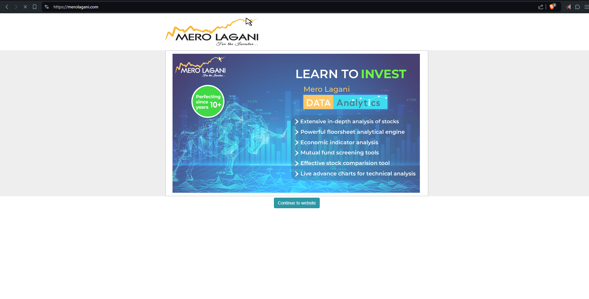
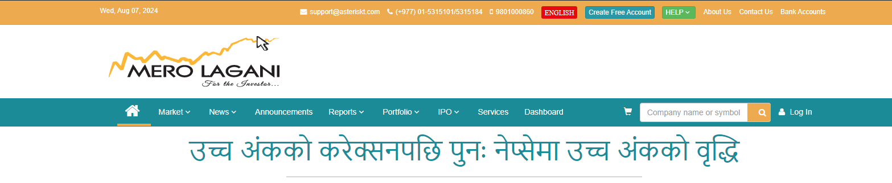

# Remove Elements by IDs and Classes

This is a Brave browser extension that removes elements with specified IDs and class names from the website `merolagani.com`. The extension ensures that these elements are removed immediately as they appear on the page.

### Before:
- Offer Page

- Ads


### After:

- No Offer Page
- No Ads



## Features

- Removes elements with specified IDs.
- Removes elements with specified class names.
- Uses `MutationObserver` to monitor and remove elements as they are added to the DOM.

## Installation

1. Clone or download this repository to your local machine.

2. Open the Brave browser.

3. Navigate to `brave://extensions/`.

4. Enable "Developer mode" using the toggle in the top right corner.

5. Click on "Load unpacked" and select the directory where you have the `manifest.json` and `content.js` files.

## Usage

1. By default, the extension will remove elements with IDs specified in the `idsToRemove` array and class names specified in the `classesToRemove` array in the `content.js` file.

2. To customize the IDs and class names to be removed, edit the `content.js` file and modify the `idsToRemove` and `classesToRemove` arrays.

### Example:

```javascript
// List of IDs to remove
const idsToRemove = ['offer_modal', 'another_id', 'yet_another_id'];

// List of class names to remove
const classesToRemove = ['class_to_remove', 'another_class', 'yet_another_class'];
```

## Files

- `manifest.json` - The file that describes the extension and its properties.
- `content.js` - The script that contains the logic to remove elements by IDs and class names.

## manifest.json

```json
{
  "manifest_version": 3,
  "name": "Remove Elements by IDs and Classes",
  "version": "1.0",
  "description": "Remove elements with specified IDs and class names from merolagani.com",
  "permissions": [
    "activeTab"
  ],
  "content_scripts": [
    {
      "matches": ["*://*.merolagani.com/*"],
      "js": ["content.js"],
      "run_at": "document_start"
    }
  ]
}
```

## content.js

```javascript
// List of IDs to remove
const idsToRemove = ['offer_modal', 'another_id', 'yet_another_id'];

// List of class names to remove
const classesToRemove = ['class_to_remove', 'another_class', 'yet_another_class'];

// Function to remove elements with the specified IDs
function removeElementsByIds() {
  idsToRemove.forEach(id => {
    const element = document.getElementById(id);
    if (element) {
      element.remove();
    }
  });
}

// Function to remove elements with the specified class names
function removeElementsByClasses() {
  classesToRemove.forEach(className => {
    const elements = document.getElementsByClassName(className);
    Array.from(elements).forEach(element => {
      element.remove();
    });
  });
}

// Function to remove both IDs and class names
function removeElements() {
  removeElementsByIds();
  removeElementsByClasses();
}

// Use MutationObserver to monitor the document for changes
const observer = new MutationObserver(removeElements);

// Start observing the document
observer.observe(document.documentElement, { childList: true, subtree: true });

// Initial check in case the elements are already present
removeElements();
```

## Contributing

Feel free to submit issues or pull requests if you have suggestions for improvements or find bugs.